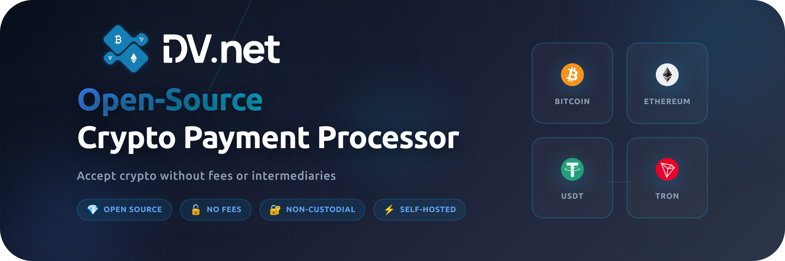
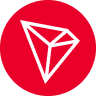
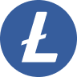

<div align="center">

# 🚀 DV.net Merchant

### Free, open‑source crypto payments processing

<br>

<br>
<br>

[](https://github.com/dv-net/.github/blob/main/profile/LICENSE)
[](https://github.com/dv-net/dv-merchant)
[](https://github.com/dv-net/dv-frontend)
[](https://docs.dv.net)

[🇬🇧 English](https://github.com/dv-net/.github/blob/main/profile/README.md) • [🇷🇺 Русский](https://github.com/dv-net/.github/blob/main/profile/ru/README.md) • [🇨🇳 中国人](https://github.com/dv-net/.github/blob/main/profile/zh/README.md)

[Website](https://dv.net) • [Docs](https://docs.dv.net) • [API](https://docs.dv.net/en/operations/post-v1-external-wallet.html) • [Support](https://dv.net/#support)

</div>

<br>

---

<br>

## 💡 About the project

**DV.net** is a completely free crypto payment processor to receive and send crypto on your website. <br>
You pay **network fees only** — no middlemen and no hidden charges.

<br>

### ⚡ Why DV.net?

<div>

> #### 🔓 **Open Source** — Anyone can verify the security of the code

> #### 💰 **No Fees** — Only network fee

> #### 🔐 **Non-custodial** — Full control over seed phrase and private key

> #### ⚙️ **Self-hosted** — Host it yourself or use the cloud version

</div>

<br>

## ✨ Features

<div>

### 🎯 Main Features
- ✅ **No KYC / KYB** — no intermediaries
- ✅ **Notifications & Webhooks** — for payment statuses and incoming checks
- ✅ **No Fees** — you pay ONLY the network fee, nothing else!

### 🔧 Technical
- ✅ **API** — for sending cryptocurrency
- ✅ **TRON Delegation** — supports delegation functionality
- ✅ **Network Fee Optimization** — BTC, EVM, TRON (resources / staking)
- ✅ **CEX Support** (Binance, HTX, OKX, etc.)
- ✅ **Self-hosted** or cloud version

</div>

<br>

## 💎 Supported cryptocurrencies

<div align="center">

 <strong>Bitcoin</strong> &nbsp;&nbsp;&nbsp;&nbsp;
 <strong>TRON</strong> &nbsp;&nbsp;&nbsp;&nbsp; 
 <strong>Ethereum</strong> &nbsp;&nbsp;&nbsp;&nbsp;
 <strong>BNB Chain</strong> &nbsp;&nbsp;&nbsp;&nbsp;
 <strong>Litecoin</strong> &nbsp;&nbsp;&nbsp;&nbsp;
 <strong>Dogecoin</strong> &nbsp;&nbsp;&nbsp;&nbsp;
 <strong>BitcoinCash</strong> &nbsp;&nbsp;&nbsp;&nbsp;
 <strong>Arbitrum</strong> &nbsp;&nbsp;&nbsp;&nbsp;
 <strong>Polygon</strong> &nbsp;&nbsp;
<sub>...and many others</sub>
</div>

<div align="center">
    <span>
        It is possible to set up a contract reception • We’ll be adding &nbsp;
         <strong>Monero</strong> &nbsp;
         <strong>Solana</strong> &nbsp;
         <strong>TON</strong>
    </span>
</div>

<br>

### 🏦 Supported exchanges (CEX)
<div align="center">
 <strong>Binance</strong> &nbsp;&nbsp;&nbsp;&nbsp;
 <strong>HTX</strong> &nbsp;&nbsp;&nbsp;&nbsp;
 <strong>OKX</strong> &nbsp;&nbsp;&nbsp;&nbsp;
 <strong>KuCoin</strong> &nbsp;&nbsp;&nbsp;&nbsp;
 <strong>Bybit</strong> &nbsp;&nbsp;&nbsp;&nbsp;
 <strong>Bitget</strong> &nbsp;&nbsp;&nbsp;&nbsp;
 <strong>Gate</strong> &nbsp;&nbsp;&nbsp;&nbsp;
</div>

<br>

## 🎬 Live demo

Try the product with real transactions:

<div align="center">

### [🎮 Demo Admin](https://demo.dv.net/dv-admin/dashboard) • [💳 Demo Checkout](https://demo.dv.net/pay/wallet/7d029e2e-840b-46f8-b898-2694306d119d?amount=15)

<br>


</div>

<br>

## 🚀 Installation options

### 🖥️ Self‑Hosted
**Full control over your data**

**OS:** Linux (Ubuntu 22.04+, Debian 12, CentOS 9)  
**Requirements:** 4 CPU, 4 GB RAM, 30 GB NVMe SSD

```bash
sudo bash -c "$(curl -fsSL https://dv.net/install.sh)"
```

**✅ Production‑ready** &nbsp; **✅ Maximum security** &nbsp; **✅ No monthly fees**

[📖 Learn more](https://docs.dv.net) • [⚙️ Setup](https://docs.dv.net/en/installation/installation.html)

---

### 🖥️ Cloud

**Fastest way to start**

**Time to go live:** 5 minutes &nbsp; | &nbsp; **Support:** 24/7

[🚀 **Start now**](https://cloud.dv.net/dv-admin/auth/sign-up)

**✅ No installation** &nbsp; **✅ Managed solution** &nbsp; **✅ Support included**

[📖 Documentation](https://docs.dv.net)

---

### 🐳 Docker

**For developers**

**Time to run:** 10–15 minutes  
**Result:** `localhost:80`

```bash
git clone --recursive https://github.com/dv-net/dv-bundle.git
cd dv-bundle && cp .env.example .env
docker compose up -d
```

**✅ Local development** &nbsp; **✅ Local testing** &nbsp; **✅ Demos**

[💻 GitHub](https://github.com/dv-net/dv-bundle)


<br>

## 🖥️ Self‑Hosted installation (detailed description)

Full control over data and infrastructure. Recommended for production.

**System requirements:**
- **OS:** CentOS 9, Debian 12, Ubuntu 22.04, Ubuntu 24.04
- **CPU:** 4 cores
- **RAM:** 4 GB
- **Disk:** 30 GB NVMe SSD
- **Network:** Open ports 80, 443

**One‑liner install:**

```bash
sudo bash -c "$(curl -fsSL https://dv.net/install.sh)"
```

The installer will:
- Check system requirements
- Install dependencies
- Configure the database
- Start all services

> **⚠️ Important:** If firewall is enabled, open ports `80` and `443`:
> ```bash
> sudo ufw allow 80/tcp
> sudo ufw allow 443/tcp
> ```

**After installation:**

1. Open in the browser:
    - `https://your-domain.com` (if a domain is configured)
    - `http://your-ip-address` (if using IP)

2. You’ll see the setup wizard welcome screen

3. Create the admin user

4. Log in to the dashboard

5. Connect your exchange (Binance, HTX, OKX, etc.)

6. Start accepting crypto!

**Benefits:**
- ✅ Full data ownership
- ✅ Maximum security
- ✅ Customizable
- ✅ Independent from cloud providers
- ✅ No monthly fees

**Great for:**
- 🎯 Enterprises with strict security
- 🎯 Teams with own infrastructure
- 🎯 Projects with privacy requirements

**More setup options:**

Full installation docs: [docs.dv.net](https://docs.dv.net)

<br>

## 📚 Documentation

<div>

> #### 📖 [Full documentation](https://docs.dv.net)  — Guides for installation, configuration and usage

> #### 🔌 [API Reference](https://docs.dv.net/en/operations/post-v1-external-wallet.html) — Integration and API usage docs

> #### 💬 [Support 24/7](https://dv.net/#support) — Telegram, WhatsApp, WeChat, Email — we're always online

</div>

<br>

## 🔐 Security

### How we protect your funds

1. **🔒 Non‑custodial** — wallets live on your side only, we have no access
2. **⚡ Immediate settlement** — funds go straight to your exchange or wallet
3. **🏠 Self‑hosted** — full control on your own server
4. **🔍 Open Source** — anyone can audit the code

<br>

## 🛠 Development

For developers who want to contribute:

```bash
# Clone the repository
git clone https://github.com/dv-net/dv-merchant.git
cd dv-merchant

# Download dependencies
go mod download

# Run tests
make test

# Lint code
make lint

# Build
make build
```

See more in [dv-merchant](https://github.com/dv-net/dv-merchant) for developers.

<br>

## 🤝 Support the project

<div>

> #### ⭐ **Star on GitHub**  — Give us a star if this project helps you

> #### 🐛 **Report a bug** — Help us get better

> #### 💡 **Suggest an idea** — Your ideas matter

> #### 🔧 **Contribute** — Pull requests are welcome

</div>

<br>

## 📞 Contacts

<div align="center">

**Telegram:** [@dv_net_support_bot](https://t.me/dv_net_support_bot) • **Email:** [support@dv.net](https://dv.net/#support)

**Website:** [dv.net](https://dv.net) • **Documentation:** [docs.dv.net](https://docs.dv.net)

</div>

<br>

## 📄 License

This project is released under the [MIT](LICENSE) license.

<br>

<div align="center">

**© 2025 DV.net** • [DV Technologies Ltd.](https://dv.net)

*Built with ❤️ for the crypto community*

</div>
