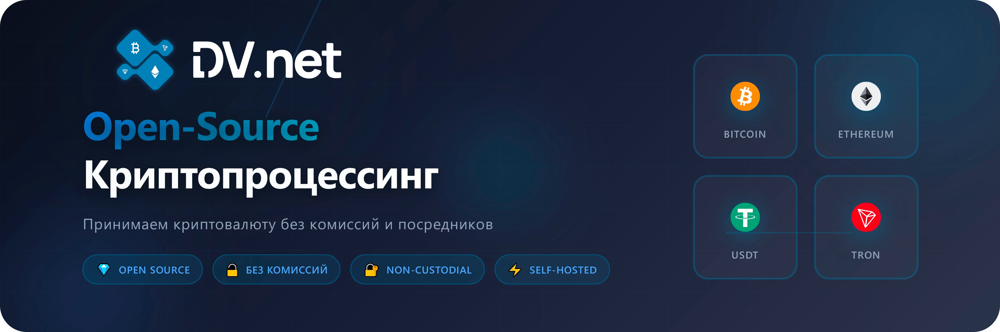

<div align="center">

# 🚀 DV.net Merchant

### Бесплатный криптопроцессинг с открытым исходным кодом

<br>

<br>
<br>

[](https://github.com/dv-net/.github/blob/main/profile/LICENSE)
[](https://github.com/dv-net/dv-merchant)
[](https://github.com/dv-net/dv-frontend)
[](https://docs.dv.net)

[🇬🇧 English](https://github.com/dv-net/.github/blob/main/profile/README.md) • [🇷🇺 Русский](https://github.com/dv-net/.github/blob/main/profile/ru/README.md) • [🇨🇳 中国人](https://github.com/dv-net/.github/blob/main/profile/zh/README.md)

[Веб-сайт](https://dv.net) • [Документация](https://docs.dv.net) • [API](https://docs.dv.net/en/operations/post-v1-external-wallet.html) • [Поддержка](https://dv.net/#support)

</div>

<br>

---

<br>

## 💡 О проекте

**DV.net** это полностью бесплатный криптопроцессинг для приёма и отправки криптовалюты на вашем сайте. <br>
Вы платите **только комиссию сети**, без посредников и скрытых платежей.

<br>

### ⚡ Почему DV.net?

<div>

> #### 🔓 **Open Source**  — Любой может проверить безопасность кода

> #### 💰 **Без комиссий** — Только сетевая комиссия

> #### 🔐 **Некастодиальный** — Полный контроль над сид-фразой и закрытым ключом

> #### ⚙️ **Self‑hosted** — Самостоятельный хостинг или облачная версия

</div>

<br>

## ✨ Возможности

<div>

### 🎯 Основные
- ✅ **Без KYC / KYB** — без посредников
- ✅ **Уведомления и вебхуки** — о статусах платежей, сверка поступлений
- ✅ **Без комиссий** — вы платите ТОЛЬКО комиссию сети и всё!

### 🔧 Технические
- ✅ **API** — для отправки криптовалюты
- ✅ **Делегирование TRON** — поддержка функции делегирования
- ✅ **Оптимизация сетевых комиссий** — BTC, EVM, TRON (ресурсы / стейкинг)
- ✅ **Поддержка CEX** (Binance, HTX, OKX и др.)
- ✅ **Self‑hosted** или облако

</div>

<br>

## 💎 Поддерживаемые криптовалюты

<div align="center">

 <strong>Bitcoin</strong> &nbsp;&nbsp;&nbsp;&nbsp;
 <strong>TRON</strong> &nbsp;&nbsp;&nbsp;&nbsp; 
 <strong>Ethereum</strong> &nbsp;&nbsp;&nbsp;&nbsp;
 <strong>BNB Chain</strong> &nbsp;&nbsp;&nbsp;&nbsp;
 <strong>Litecoin</strong> &nbsp;&nbsp;&nbsp;&nbsp;
 <strong>Dogecoin</strong> &nbsp;&nbsp;&nbsp;&nbsp;
 <strong>BitcoinCash</strong> &nbsp;&nbsp;&nbsp;&nbsp;
 <strong>Arbitrum</strong> &nbsp;&nbsp;&nbsp;&nbsp;
 <strong>Polygon</strong> &nbsp;&nbsp;
<sub>...и многие другие</sub>
</div>

<div align="center">
    <span>
        Можно настроить приём по контракту • Скоро добавим &nbsp;
         <strong>Monero</strong> &nbsp;
         <strong>Solana</strong> &nbsp;
         <strong>TON</strong>
    </span>
</div>

<br>

### 🏦 Поддерживаемые биржи (CEX)
<div align="center">
 <strong>Binance</strong> &nbsp;&nbsp;&nbsp;&nbsp;
 <strong>HTX</strong> &nbsp;&nbsp;&nbsp;&nbsp;
 <strong>OKX</strong> &nbsp;&nbsp;&nbsp;&nbsp;
 <strong>KuCoin</strong> &nbsp;&nbsp;&nbsp;&nbsp;
 <strong>Bybit</strong> &nbsp;&nbsp;&nbsp;&nbsp;
 <strong>Bitget</strong> &nbsp;&nbsp;&nbsp;&nbsp;
 <strong>Gate</strong> &nbsp;&nbsp;&nbsp;&nbsp;
</div>

<br>

## 🎬 Живая демоверсия

Попробуйте реальную работу системы с настоящими транзакциями:

<div align="center">

### [🎮 Демо Панель](https://demo.dv.net/dv-admin/dashboard) • [💳 Демо Оплата](https://demo.dv.net/pay/wallet/7d029e2e-840b-46f8-b898-2694306d119d?amount=15)

</div>

<br>

## 🚀 Варианты установки

### 🖥️ Self‑Hosted
**Полный контроль над вашими данными**

**ОС:** Linux (Ubuntu 22.04+, Debian 12, CentOS 9)  
**Требования:** 4 CPU, 4 GB RAM, 30 GB NVMe SSD

```bash
sudo bash -c "$(curl -fsSL https://dv.net/install.sh)"
```

**✅ Идеально для продакшена** &nbsp; **✅ Максимальная безопасность** &nbsp; **✅ Без ежемесячных платежей**

[📖 Подробнее](https://docs.dv.net) • [⚙️ Установка](https://docs.dv.net/en/installation/installation.html)

---

### 🖥️ Облако (Cloud)

**Самый быстрый способ начать**

**Время запуска:** 5 минут &nbsp; | &nbsp; **Поддержка:** 24/7

[🚀 **Начать сейчас**](https://cloud.dv.net/dv-admin/auth/sign-up)

**✅ Без установки** &nbsp; **✅ Управляемое решение** &nbsp; **✅ Есть поддержка**

[📖 Документация](https://docs.dv.net)

---

### 🐳 Docker

**Для разработчиков**

**Время запуска:** 10-15 минут  
**Результат:** `localhost:80`

```bash
git clone --recursive https://github.com/dv-net/dv-bundle.git
cd dv-bundle && cp .env.example .env
docker compose up -d
```

**✅ Локальная разработка** &nbsp; **✅ Локальное тестирование** &nbsp; **✅ Демонстрации**

[💻 GitHub](https://github.com/dv-net/dv-bundle)


<br>

## 🖥️ Self-Hosted установка (подробное описание)

Полный контроль над данными и инфраструктурой. Рекомендуется для продакшена.

**Системные требования:**
- **ОС:** CentOS 9, Debian 12, Ubuntu 22.04, Ubuntu 24.04
- **CPU:** 4 ядра
- **RAM:** 4 GB
- **Диск:** 30 GB NVMe SSD
- **Сеть:** Открытые порты 80, 443

**Установка одной командой:**

```bash
sudo bash -c "$(curl -fsSL https://dv.net/install.sh)"
```

Скрипт автоматически:
- Проверит системные требования
- Установит все необходимые зависимости
- Настроит базу данных
- Запустит все сервисы

> **⚠️ Важно:** Если у вас включён файрвол (firewall), не забудьте открыть порты `80` and `443`:
> ```bash
> sudo ufw allow 80/tcp
> sudo ufw allow 443/tcp
> ```

**После установки:**

1. Откройте браузер и перейдите на:
    - `https://your-domain.com` (если настроен домен)
    - `http://your-ip-address` (если используете IP)

2. Вы увидите экран приветствия мастера установки

3. Создание администратора

4. После завершения настройки войдите в панель управления

5. Подключите биржу (Binance, HTX, OKX и др.)

6. Начните принимать криптовалюту!

**Преимущества:**
- ✅ Полный контроль над данными
- ✅ Максимальная безопасность
- ✅ Возможность кастомизации
- ✅ Независимость от облачных сервисов
- ✅ Без ежемесячных платежей

**Идеально подходит для:**
- 🎯 Крупного бизнеса с высокими требованиями к безопасности
- 🎯 Компаний с собственной IT-инфраструктурой
- 🎯 Проектов с особыми требованиями к конфиденциальности

**Дополнительные настройки:**

Полная документация по установке: [docs.dv.net](https://docs.dv.net)

<br>

## 📚 Документация

<div>

> #### 📖 [Полная документация](https://docs.dv.net)  — Подробные руководства по установке, настройке и использованию

> #### 🔌 [API Reference](https://docs.dv.net/en/operations/post-v1-external-wallet.html) — Документация по интеграции и использованию API

> #### 💬 [Поддержка 24/7](https://dv.net/#support) — Telegram, WhatsApp, WeChat, Email — мы всегда на связи

</div>

<br>

## 🔐 Безопасность

### Как мы защищаем ваши средства

1. **🔒 Некастодиальность** — все кошельки хранятся только у вас, мы не имеем к ним доступа
2. **⚡ Мгновенный перевод** — средства сразу отправляются на биржу или ваш личный кошелёк
3. **🏠 Self-hosted** — полный контроль при установке на ваш сервер
4. **🔍 Открытый код** — любой может проверить безопасность системы

<br>

## 🛠 Разработка

Для разработчиков, желающих улучшить проект:

```bash
# Клонирование репозитория
git clone https://github.com/dv-net/dv-merchant.git
cd dv-merchant

# Установка зависимостей
go mod download

# Запуск тестов
make test

# Линтинг кода
make lint

# Сборка
make build
```

Подробнее в [dv-merchant](https://github.com/dv-net/dv-merchant) для разработчиков.

<br>

## 🤝 Поддержка проекта

<div>

> #### ⭐ **Star on GitHub**  — Поставьте звезду, если проект полезен

> #### 🐛 **Сообщить об ошибке** — Помогите нам стать лучше

> #### 💡 **Предложить идею** — Ваши идеи важны для нас

> #### 🔧 **Внести вклад** — Pull requests приветствуются

</div>

<br>

## 📞 Контакты

<div align="center">

**Telegram:** [@dv_net_support_bot](https://t.me/dv_net_support_bot) • **Чат в Telegram:** [@dv_net_support_chat](https://t.me/dv_net_support_chat) • **Discord:** [discord.gg/fh7D2B4Jx6](https://discord.gg/fh7D2B4Jx6)

**Email:** [support@dv.net](https://dv.net/#support) • **Сайт:** [dv.net](https://dv.net) • **Документация:** [docs.dv.net](https://docs.dv.net)

</div>

<br>

## 📄 Лицензия

Данный проект выпущен под лицензией [MIT](https://github.com/dv-net/.github/blob/main/profile/LICENSE).

<br>

<div align="center">

**© 2025 DV.net** • [DV Technologies Ltd.](https://dv.net)

*Сделано с ❤️ для криптосообщества*

</div>
