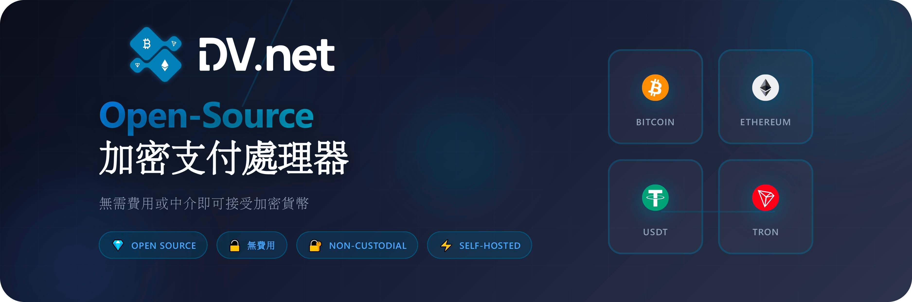

<div align="center">

# 🚀 DV.net 商户端

### 免费、开源的加密货币支付处理平台

<br>

<br><br>

[](https://github.com/dv-net/.github/blob/main/profile/LICENSE)
[](https://github.com/dv-net/dv-merchant)
[](https://github.com/dv-net/dv-frontend)
[](https://docs.dv.net)

[🇬🇧 English](https://github.com/dv-net/.github/blob/main/profile/README.md) • [🇷🇺 Русский](https://github.com/dv-net/.github/blob/main/profile/ru/README.md) • [🇨🇳 中文](https://github.com/dv-net/.github/blob/main/profile/zh/README.md)

[网站](https://dv.net) • [文档](https://docs.dv.net) • [API](https://docs.dv.net/en/operations/post-v1-external-wallet.html) • [支持](https://dv.net/#support)

</div>

---

## 💡 项目简介

**DV.net** 是一个完全免费的加密货币支付处理系统，用于在你的网站上收发加密货币。<br>
你只需支付 **网络手续费** —— 无中间商，无隐藏费用。

### ⚡ 为什么选择 DV.net？

<div>

> #### 🔓 **开源** — 任何人都可以验证代码的安全性

> #### 💰 **无手续费** — 仅需支付网络手续费

> #### 🔐 **非托管** — 完全掌控助记词和私钥

> #### ⚙️ **自托管** — 可自行部署或使用云端版本

</div>


## ✨ 功能特色

<div>

### 🎯 主要功能
- ✅ **无需 KYC / KYB** — 无中介
- ✅ **通知与 Webhook** — 支付状态与入账提醒
- ✅ **无手续费** — 您只需支付网络手续费！

### 🔧 技术特性
- ✅ **API 接口** — 用于发送加密货币
- ✅ **TRON 委托** — 支持委托功能
- ✅ **网络手续费优化** — BTC、EVM、TRON（资源 / 质押）
- ✅ **CEX 支持**（Binance、HTX、OKX 等）
- ✅ **自托管** 或 云端版本

</div>

## 💎 支持的加密货币

<div align="center">

 <strong>Bitcoin</strong> &nbsp;&nbsp;&nbsp;&nbsp;
 <strong>TRON</strong> &nbsp;&nbsp;&nbsp;&nbsp;
 <strong>Ethereum</strong> &nbsp;&nbsp;&nbsp;&nbsp;
 <strong>BNB Chain</strong> &nbsp;&nbsp;&nbsp;&nbsp;
 <strong>Litecoin</strong> &nbsp;&nbsp;&nbsp;&nbsp;
 <strong>Dogecoin</strong> &nbsp;&nbsp;&nbsp;&nbsp;
 <strong>BitcoinCash</strong> &nbsp;&nbsp;&nbsp;&nbsp;
 <strong>Arbitrum</strong> &nbsp;&nbsp;&nbsp;&nbsp;
 <strong>Polygon</strong> &nbsp;&nbsp;&nbsp;&nbsp;
<sub>……以及更多</sub>
</div>

<div align="center">
    <span>
        支持合约收款 • 即将新增 &nbsp;
         <strong>Monero</strong> &nbsp;
         <strong>Solana</strong> &nbsp;
         <strong>TON</strong>
    </span>
</div>

<br>

### 🏦 支持的交易所（CEX）
<div align="center">
 <strong>Binance</strong> &nbsp;&nbsp;&nbsp;&nbsp;
 <strong>HTX</strong> &nbsp;&nbsp;&nbsp;&nbsp;
 <strong>OKX</strong> &nbsp;&nbsp;&nbsp;&nbsp;
 <strong>KuCoin</strong> &nbsp;&nbsp;&nbsp;&nbsp;
 <strong>Bybit</strong> &nbsp;&nbsp;&nbsp;&nbsp;
 <strong>Bitget</strong> &nbsp;&nbsp;&nbsp;&nbsp;
 <strong>Gate</strong> &nbsp;&nbsp;&nbsp;&nbsp;
</div>

<br>

## 🎬 在线演示

体验带真实交易的产品演示：

<div align="center">

### [🎮 管理后台演示](https://demo.dv.net/dv-admin/dashboard) • [💳 支付结账演示](https://demo.dv.net/pay/wallet/7d029e2e-840b-46f8-b898-2694306d119d?amount=15)

</div>

<br>

## 🚀 安装选项

### 🖥️ 自托管（Self‑Hosted）
**对你的数据拥有完全控制权**

**支持的操作系统（OS）：** Linux (Ubuntu 22.04+、Debian 12、CentOS 9)  
**最低配置要求：** 4 CPU、4 GB 内存、30 GB NVMe SSD

```bash
sudo bash -c "$(curl -fsSL https://dv.net/install.sh)"
```

**✅ 适用于生产环境** &nbsp; **✅ 最高安全性** &nbsp; **✅ 无月度费用**

[📖 了解更多](https://docs.dv.net) • [⚙️ 设置指南](https://docs.dv.net/en/installation/installation.html)

---

### ☁️ 云托管（Cloud）

**最快上手的方式**

**上线所需时间：** 5 分钟 &nbsp; | &nbsp; **支持服务：** 24/7

[🚀 **立即开始**](https://cloud.dv.net/dv-admin/auth/sign-up)

**✅ 无需安装** &nbsp; **✅ 托管方案** &nbsp; **✅ 含技术支持**

[📖 文档](https://docs.dv.net)

---

### 🐳 Docker 版本

**适合开发者**

**运行时间：** 10-15 分钟  
**运行结果：** `localhost:80`

```bash
git clone --recursive https://github.com/dv-net/dv-bundle.git
cd dv-bundle && cp .env.example .env
docker compose up -d
```

**✅ 本地开发** &nbsp; **✅ 本地测试** &nbsp; **✅ 演示演练**

[💻 GitHub](https://github.com/dv-net/dv-bundle)


<br>

## 🖥️ 自托管安装（详细说明）

完全控制数据与基础设施。推荐用于生产环境。

**系统要求：**
- **操作系统（OS）：** CentOS 9、Debian 12、Ubuntu 22.04、Ubuntu 24.04
- **CPU：** 4 核
- **内存：** 4 GB
- **磁盘：** 30 GB NVMe SSD
- **网络：** 开放端口 80、443

**一键安装：**

```bash
sudo bash -c "$(curl -fsSL https://dv.net/install.sh)"
```

安装脚本会执行：
- 检查系统要求
- 安装所需依赖
- 配置数据库
- 启动所有服务

> **⚠️ 重要提示：** 如果防火墙开启，请放行端口 `80` 和 `443`：
> ```bash
> sudo ufw allow 80/tcp
> sudo ufw allow 443/tcp
> ```

**安装完成后：**

1. 在浏览器中打开：
    - `https://your-domain.com`（若已配置域名）
    - `http://your-ip-address`（若使用 IP）

2. 你将看到安装向导欢迎页面

3. 创建管理员账号

4. 登录管理面板

5. 连接你的交易所（Binance、HTX、OKX 等）

6. 开始接收加密货币支付！

**优点：**
- ✅ 完全的数据所有权
- ✅ 最高安全性
- ✅ 可定制化
- ✅ 不依赖云服务提供商
- ✅ 无月度订阅费用

**适合场景：**
- 🎯 对安全要求严格的企业
- 🎯 拥有自建基础设施的团队
- 🎯 关注隐私保护的项目

**更多部署选项：**

完整安装文档： [docs.dv.net](https://docs.dv.net)

<br>

## 📚 文档

<div>

> #### 📖 [完整文档](https://docs.dv.net)  — 安装、配置和使用指南

> #### 🔌 [API 参考](https://docs.dv.net/en/operations/post-v1-external-wallet.html) — 集成与 API 使用说明

> #### 💬 [24/7 技术支持](https://dv.net/#support) — Telegram、WhatsApp、WeChat、电子邮箱 — 我们随时在线

</div>

<br>

## 🔐 安全性

### 我们如何保护你的资金

1. **🔒 非托管设计** — 钱包仅在你端，DV.net 无法访问
2. **⚡ 即时结算** — 资金直接进入你的交易所或钱包账户
3. **🏠 自托管部署** — 在你自己的服务器上运行
4. **🔍 开源代码** — 所有人都可以审计

<br>

## 🛠 开发

供想贡献的开发者参考：

```bash
# 克隆仓库
git clone https://github.com/dv-net/dv-merchant.git
cd dv-merchant

# 下载依赖
go mod download

# 运行测试
make test

# 代码风格检查（lint）
make lint

# 构建
make build
```

更多开发者信息见 [dv-merchant](https://github.com/dv-net/dv-merchant)。

<br>

## 🤝 支持项目

<div>

> #### ⭐ **在 GitHub 上点个 Star** — 如果这个项目对你有帮助，请点赞

> #### 🐛 **报告 Bug** — 帮助我们改进

> #### 💡 **提出想法** — 你的建议很重要

> #### 🔧 **贡献代码** — 欢迎提交 Pull Request

</div>

<br>

## 💝 捐赠

用加密货币支持项目发展：

> 💵 **USDT (Tron)** — `TCB4bYYN5x1z9Z4bBZ7p3XxcMwdtCfmNdN`

>  **Bitcoin** — `bc1qemvhkgzr4r7ksgxl8lv0lw7mnnthfc6990v3c2`

>  **TRON (TRX)** — `TCB4bYYN5x1z9Z4bBZ7p3XxcMwdtCfmNdN`

>  **Ethereum** — `0xf1e4c7b968a20aae891cc18b1d5836b806691d47`

🔗 其他网络和代币（BNB Chain、Arbitrum、Polygon、Litecoin、Dogecoin、Bitcoin Cash 等）请访问 **[dv.net/donate](https://dv.net/ru/donate)**

<br>

## 📞 联系方式

<div align="center">

**Telegram:** [@dv_net_support_bot](https://t.me/dv_net_support_bot) • **Telegram 群组:** [@dv_net_support_chat](https://t.me/dv_net_support_chat) • **Discord:** [discord.gg/fh7D2B4Jx6](https://discord.gg/fh7D2B4Jx6)

**邮箱:** [support@dv.net](https://dv.net/#support) • **网站:** [dv.net](https://dv.net) • **文档:** [docs.dv.net](https://docs.dv.net)

</div>

<br>

## 📄 许可证

本项目在 [MIT](https://github.com/dv-net/.github/blob/main/profile/LICENSE) 许可下发布。

<br>

<div align="center">

**© 2026 DV.net** • [DV Technologies Ltd.](https://dv.net)

*为加密货币社区倾心打造 ❤️*

</div>
