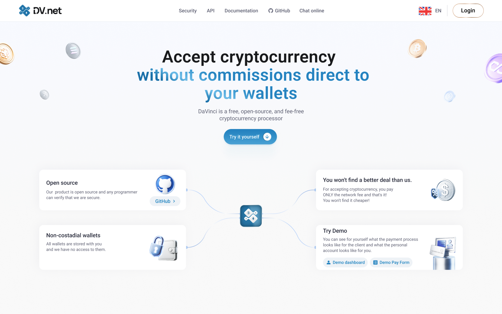

<div align="right">
  <h3>
    <a href="README.md">
      🇬🇧 English
    </a>
    <span> | </span>
    <a href="ru/README.md">
      🇷🇺 Русский
    </a>
    <span> | </span>
    <a href="zh/README.md">
      🇨🇳 中国人
    </a>
  </h3>
</div>

# DV.net

<div align="center">
  
</div>


<h3 align="center">
  加密货币支付解决方案
</h3>

<p align="center"> DV.net 是一个免费的开源加密支付处理器，允许您在没有手续费或中介的情况下，接受所有流行的
加密货币。
</p>

<div align="center">
  <h3>
    <a href="https://dv.net">
      网站
    </a>
    <span> | </span>
    <a href="https://docs.dv.net">
      文档
    </a>
    <span> | </span>
    <a href="https://docs.dv.net/en/operations/post-v1-external-wallet.html">
      API 接口
    </a>
    <span> | </span>
    <a href="https://dv.net/#support">
      支持
    </a>
  </h3>
</div>

## 📑 目录

* [实时演示](#-live-demo)
* [功能特性](#-features)
* [安装](#-installation)
* [文档](#-documentation)

## 🎬 实时演示

您可以尝试实时演示，它带有真实的交易、真实的交易所和真实的代币。

<div align="left">
  <h3>
    <a href="https://demo.dv.net/dv-admin/dashboard">
      实时演示面板
    </a>
    <span> | </span>
    <a href="https://demo.dv.net/pay/wallet/7d029e2e-840b-46f8-b898-2694306d119d?amount=15">
      实时演示支付表单
    </a>
  </h3>
</div>


## 🌟 功能特性

* 开源，任何程序员都可以验证我们的安全性。
* **零手续费**，您**只需**支付网络费用，仅此而已！
* 无需 KYB (企业了解)，无中介，无需 KYC (个人身份认证)
* **非托管**（完全控制助记词和私钥）
* 可**自托管**或使用云版本
* 支持所有流行的加密货币（比特币 Bitcoin, USDT Tether, 以太坊 Etherium, TRON, BNB 等等）
* 支持所有流行的加密货币交易所（CEX）
* 支持 TRON 质押（Delegation）功能


## 🚀 安装

使用提供的脚本安装商家：

```bash
sudo bash -c "$(curl -fsSL [https://dv.net/install.sh](https://dv.net/install.sh))"
````

请注意，如果您的服务器上有防火墙，您需要将 **80 和 443 端口**添加到例外中。

系统要求您可以在我们的 [完整文档](https://docs.dv.net/) 中找到

## 📗 文档

请查看我们的 [官方网站](https://dv.net/) 和 [完整文档](https://docs.dv.net/) 以获取更多详细信息。
